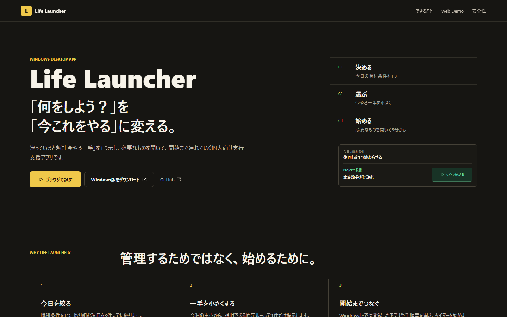

# Life Launcher Web Demo

「何をしよう？」を「今これをやる」に変える、Life LauncherのインタラクティブWeb Demoです。

**[Live Demoをブラウザで試す](https://life-launcher-web.takuyakou.workers.dev)**

[Windows版 v1.0.0](https://github.com/Takuyakou/life-launcher/releases/tag/v1.0.0) ・ [Life Launcher本体](https://github.com/Takuyakou/life-launcher)



## What

Life Launcherの中心的な流れを、ブラウザ上のサンプルデータで体験できます。

- 「今日の勝利条件」の編集・完了と、「今やる一手」の切り替え
- 次の一手・やりたいことを候補にまとめる「今日を組み立てる」
- 「今日へ」で選んだ項目だけを最大3件で実行する「今日の3件」
- 短時間 / 通常タイマーの開始・一時停止・再開・終了
- Demo用の満了フロー、次の一手の更新、「今日の実行」への記録
- 辞書の検索とデモ状態のリセット
- Windows版で「開始すると環境が揃う」流れのDemo演出

Web Demoでは、Windows版のアプリ・ファイル・URL起動を実際には行わず、開始時の流れを演出として確認できます。

## Windows Product

Web DemoはLife Launcherの中心体験を紹介するショーケースです。

実際のWindows版では、アプリ・ファイル・フォルダ・URLの起動、手順書ビューア、ネイティブウィンドウなどを利用できます。

- [Life Launcher](https://github.com/Takuyakou/life-launcher)
- [Download v1.0.0](https://github.com/Takuyakou/life-launcher/releases/tag/v1.0.0)

## Limitations

Web DemoはWindows製品版の完全移植ではありません。

- データは汎用的なsynthetic dataです
- Rustの推薦ロジックは再実装せず、説明可能な固定サンプルを使用します
- アプリ・ファイル・URLの起動はDemo演出のみです
- D&D、手順書、バックアップ、設定、記録の完全機能は含みません
- visitorが変更したDemo stateはブラウザのlocalStorageに保存します
- 入力内容をアプリ側サーバーへ送信しません

## Development

React 18 / TypeScript / Viteで構築しています。

```powershell
npm.cmd ci
npm.cmd run dev
```

Validation:

```powershell
npm.cmd run public:check
npm.cmd run lint
npm.cmd run test
npm.cmd run build
npm.cmd run test:e2e
npm.cmd run test:visual
```

OG画像を再生成する場合は、dev serverを起動してから`npm.cmd run screenshot:og`を実行します。

## Deployment

Production: [life-launcher-web.takuyakou.workers.dev](https://life-launcher-web.takuyakou.workers.dev)

Cloudflare Workers + Static Assetsで配信しています。GitHubの`main`更新をCloudflareがbuild / deployします。

- Build command: `npm run build`
- Build output: `dist`

backend、database、authentication、analytics、secretは使用しません。

## Usage

Source available for viewing. All rights reserved unless otherwise stated.
