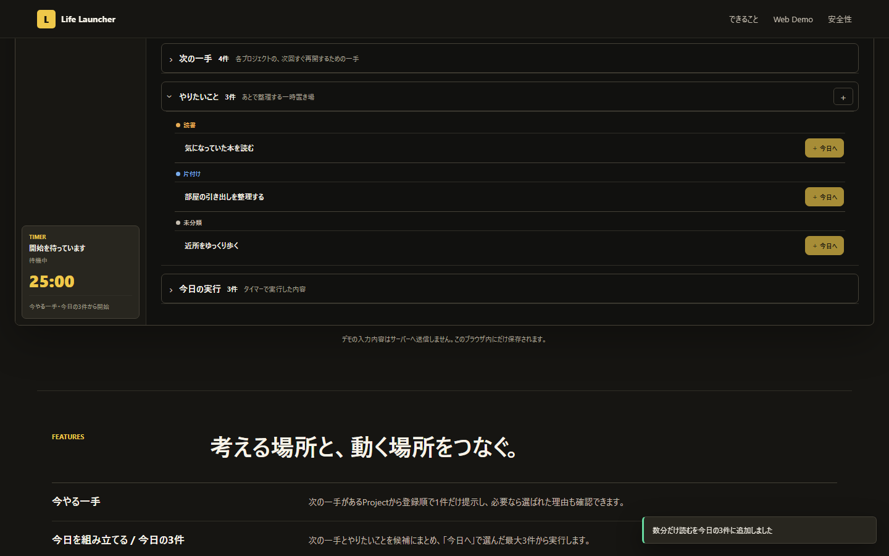

# Life Launcher Web Demo

「何をしよう？」を「今これをやる」に変える、Life LauncherのインタラクティブWeb Demoです。

**[Live Demoをブラウザで試す](https://life-launcher-web.takuyakou.workers.dev/)**

[Windows版をダウンロード](https://github.com/Takuyakou/life-launcher/releases/latest) ・ [Life Launcher本体](https://github.com/Takuyakou/life-launcher)



## できること

Life Launcher v1.3の中心的な流れを、ブラウザ上のサンプルデータで体験できます。

- 「今日の勝利条件」の編集・達成と、Projectの色に沿う「今やる一手」の切り替え
- Projectごとの次の一手と、Project別または未分類のやりたいことを登録
- Today Pickerで次の一手・やりたいことから最大3件を選択
- 今日の3件で使用中の登録元をSource Lockで保護
- 5分 / 25分タイマーの開始・一時停止・再開・終了
- 予定時間の満了後に確定して完了。3件すべて完了したら「次の3件を選ぶ」で次へ
- 満了時の次の一手の更新、「今日の実行」への記録、辞書検索、状態のリセット
- 「今日の3件から外す」で、元の次の一手・やりたいこと・候補・実行記録を残して採用だけを解除

「今日やるものを選ぶ」は今日の3件にあるボタンから開きます。3件目の追加で自動的に確定し、登録元は次の一手・やりたいことに残ります。

「今日の3件から外す」は確認ダイアログなしで利用できます。対象のタイマー実行中・一時停止中・満了確認待ちは解除できません。完了済みの項目を外しても実行記録は残ります。

Web Demoでは起動動作を演出しています。Windows版では登録したアプリ・ファイル・URLを実際に開きます。

## Web Demoの範囲

※Windows製品版の完全移植ではありません。

- 合成サンプルを使用しています。推薦理由は固定で、Rustの推薦ロジックは移植していません。
- プロジェクトは用意された4件です。新規登録はやりたいことから行い、プロジェクトの次の一手はタイマー満了時に編集できます。
- D&D、手順書ビューア、ネイティブウィンドウ、複数ディスプレイ対応、バックアップ、設定の完全機能は含みません。
- アプリ・ファイル・URLの起動は演出のみで、外部アプリやローカルファイルを実際には開きません。
- 入力・選択・候補の除外・実行記録・開閉状態は、このブラウザのlocalStorageに保存します。入力内容をアプリ側サーバーへ送信しません。
- 保存に失敗した変更は画面に反映せず、変更前の状態を保持します。
- 今日の3件と候補の除外状態は、日付が変わっても自動ではリセットされません。解除・次の3件の選択・リセットなどの操作で変更します。
- 再読み込みすると、進行中・一時停止中・満了未確定のタイマーは待機状態へ戻ります。
- Demo用の「満了まで進める」で予定時間まで進められます。途中終了もサンプル記録になりますが、今日の3件の完了にはなりません。

## 開発

React 18 / TypeScript / Viteで構築しています。

```powershell
npm.cmd ci
npm.cmd run dev
```

自動検証:

```powershell
npm.cmd run public:check
npm.cmd run lint
npm.cmd run test
npm.cmd run build
$env:WEB11_PREVIEW = "1"
npm.cmd run test:e2e
npm.cmd run test:visual
```

`WEB11_PREVIEW=1`ではビルド済みの`dist`を使用します。開発サーバーを停止してから実行してください。通常の開発サーバーで確認する場合は、この環境変数を解除します。

E2Eでは解除・保存失敗・タイマー・キーボード操作などを、Visual QAでは3列 / 2列 / 1列や長文表示を確認します。README画像はVisual QAで生成する合成データのスクリーンショットです。

仕様・検証記録は [docs](docs/README.md) を参照してください。

## 配信

公開先: [life-launcher-web.takuyakou.workers.dev](https://life-launcher-web.takuyakou.workers.dev/)

Cloudflare Workers + Static Assetsで配信しています。

- Build command: `npm run build`
- Build output: `dist`
- `main`へのマージ後、CloudflareのGit連携で自動ビルド・本番反映します。
- 作業ブランチのビルドではプレビューを作成します。プレビューの成功だけで本番反映済みとは判断せず、公開URLでも確認します。

2026-09-18に、v1.3 parityの全回帰、CSPを適用した本番相当E2E、Visual QAを確認しました。デプロイ設定はCloudflare側で管理され、リポジトリにはWrangler設定ファイルを置いていません。

アプリ用のバックエンド・データベース・認証・アクセス解析は使用しません。

## 利用条件

Source available for viewing. All rights reserved unless otherwise stated.
