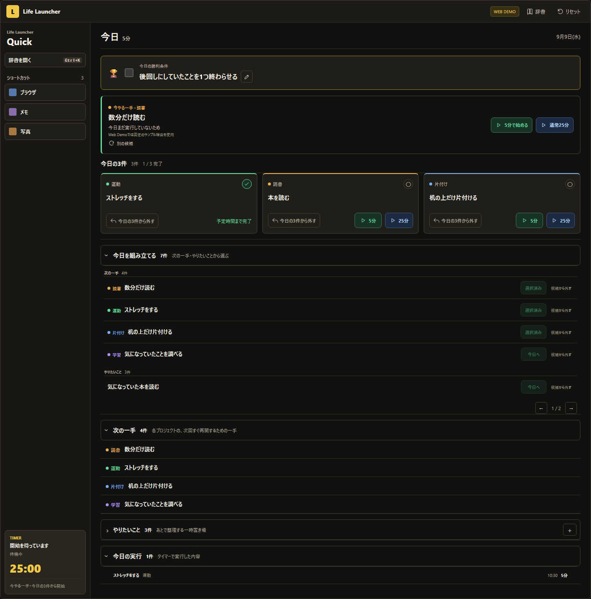

# Web README差し替え原稿

適用済み（2026-09-09）: この原稿を基に、公開済みの機能・解除操作・配信状況を反映して [root README](../../README.md) を更新しました。以下は準備時点の原稿として保存しています。現在の説明はroot READMEを参照してください。

---

# Life Launcher Web Demo

「何をしよう？」を「今これをやる」に変える、Life LauncherのインタラクティブWeb Demoです。

**[Live Demoをブラウザで試す](https://life-launcher-web.takuyakou.workers.dev/)**

[Windows版をダウンロード](https://github.com/Takuyakou/life-launcher/releases/latest) ・ [Life Launcher本体](https://github.com/Takuyakou/life-launcher)



## できること

- 今日の勝利条件の編集・達成と、今やる一手の切り替え。
- やりたいことを登録し、次の一手と一緒に「今日を組み立てる」で選択。
- 「今日へ」で最大3件を採用。候補は5件ずつ表示。
- 5分/25分タイマーの開始・一時停止・再開・終了。
- 予定時間の満了後に確定して完了。3件完了したら手動で次の3件を選択。
- 満了時の次の一手更新、実行記録、辞書検索、状態のリセット。

Web Demoでは起動動作を演出しています。Windows版では登録したアプリ・ファイル・URLを実際に開きます。

## Web Demoの範囲

※Windows製品版の完全移植ではありません。

- 合成サンプルのみ。推薦理由は固定で、Rustの推薦ロジックは移植していません。
- Projectは用意された4件。新規登録はやりたいことから行い、Projectの次の一手は満了時に編集できます。
- D&D、nativeの管理メニュー、手順書、multi-monitor、バックアップ、設定の完全機能は含みません。
- 入力・候補の除外・実行記録はこのブラウザのlocalStorageだけへ保存。アプリ側サーバーには送りません。
- Today枠と候補除外は日付で自動解除されず、Resetまで保持します。
- reloadすると進行中・未確定timerは待機状態へ戻ります。
- Demo加速は予定時間まで進めます。途中終了も分単位のサンプル記録になりますが、Today項目の完了にはなりません。

## 開発

React 18 / TypeScript / Vite。

```sh
npm ci
npm run dev
```

```sh
npm run public:check
npm run lint
npm run test
npm run build
npm run test:e2e
npm run test:visual
```

CIのE2Eは`WEB11_PREVIEW=1`でproduction bundleを使用します。CSP・通信なし・XSS・キーボード操作も検証します。

## 配信

Cloudflare Workers + Static Assets。buildは`npm run build`、出力は`dist`。
Git連携のbranch buildからversion uploadされます。version uploadと本番切替は別操作で、公開先の設定に従います。
互換基準日を更新のたびに変更する必要はありません。mainの自動本番deployを設定確認なしで断定しません。
backend、database、authentication、analyticsは追加していません。

## Usage

Source available for viewing. All rights reserved unless otherwise stated.
